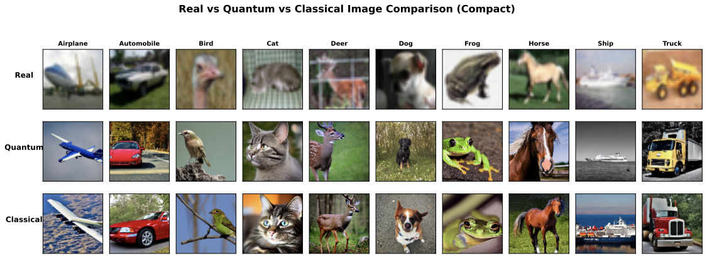

# QRL-Guided Diffusion: Quantum Reinforcement Learning for Dynamic Classifier-Free Guidance

Official implementation of

**[Quantum Reinforcement Learning-Guided Diffusion Model for Image Synthesis via Hybrid Quantum-Classical Generative Model Architectures](https://ieeexplore.ieee.org/abstract/document/11461991/)**
Chi-Sheng Chen, En-Jui Kuo
*IEEE ICASSP 2026 (oral)* · [arXiv:2509.14163](https://arxiv.org/abs/2509.14163)

[](https://arxiv.org/abs/2509.14163)
[](https://www.python.org/downloads/)
[](https://pytorch.org/)
[](https://pennylane.ai/)
[](LICENSE)

<p align="center"></p>
<p align="center"><em>Real CIFAR-10 images (top), samples guided by the QRL actor (middle), and by the classical MLP actor (bottom). Generated images are shown upsampled for display.</em></p>

## Overview

Diffusion models usually run classifier-free guidance (CFG) with a fixed or hand-designed schedule that ignores the state of the sample at each denoising step. This repo treats **guidance scheduling as a sequential decision problem**: a hybrid quantum–classical policy observes the current denoising state and outputs a per-step guidance adjustment ΔCFG, trained with PPO.

- **Actor**: a shallow variational quantum circuit (VQC) produces policy features, followed by a compact MLP head that outputs a Gaussian policy over ΔCFG.
- **Critic**: a classical MLP value network.
- **Environment**: a pretrained diffusion sampler (DDIM) wrapped as a Gymnasium-style env; one episode = one full denoising trajectory.
- **Reward**: classifier confidence on the generated image, per-step confidence gain, and an action-regularization penalty.

On CIFAR-10 the quantum actor improves PSNR and LPIPS and matches SSIM against a classical MLP actor while using roughly a quarter of the parameters (2,498 vs. 9,282).

## Method at a glance

| Component | Setting (paper) |
|---|---|
| Quantum circuit | 4 qubits, depth 2, RY–RZ angle encoding, per-layer `Rot` + ring CNOT entanglement + `RX`, Pauli-Z readout (PennyLane) |
| Actor parameters | 32 (VQC) + 2,466 (MLP head, 4→64→32→2) = **2,498** |
| Classical baseline actor | MLP 6→128→64→2, **9,282** parameters (≈9.3K) |
| State `s_t` (6-dim) | `[t/T, ‖z_t‖₂, ‖ε_t‖₂, ⟨z_t, ε_t⟩, a_{t-1}, p_proxy(y | x_t)]` |
| Action `a_t` | scalar ΔCFG, clipped to [−2, +2] |
| Effective guidance | `g_t = clip(CFG_0 + a_t, 1, 12)`, `CFG_0 = 5.0` |
| Backbone | Stable Diffusion v1.5 (`runwayml/stable-diffusion-v1-5`): latent UNet + CLIP text encoder + VAE, frozen |
| Sampler | DDIM, 50 steps |
| Proxy classifier | ResNet-18 on CIFAR-10 |
| RL algorithm | PPO + GAE (`γ = 0.995`, `λ = 0.95`, clip 0.1, entropy 0.01, value coef 0.5) |
| PPO schedule | 8 parallel envs, rollout 512, 4 epochs, minibatch 8, lr 1e-4 (actor) / 1e-3 (critic) |
| Reward | `α · log p(y | x_0)` (terminal, α = 1.0) + `β · (conf_t − conf_{t−1})` (per step, β = 0.2) − `λ_act · a_t²` (λ_act = 5e-3) + optional TV term (λ_tv = 0) |
| Dataset | CIFAR-10, 10 classes; trained on class 3 (cat), evaluated on all 10 classes |

Per-step loop:

```
s_t  ──► VQC (4q, depth 2) ──► MLP head ──► (μ, log σ) ──► a_t ~ N(μ, σ²)
g_t = clip(CFG_0 + a_t, 1, 12)
ε̂   = ε_uncond + g_t · (ε_cond − ε_uncond)
z_{t-1} = DDIM_step(z_t, ε̂)
r_t  = β · (conf_t − conf_{t−1}) − λ_act · a_t²        (+ α · log p(y | x_0) at t = 0)
```

Quantum actor circuit (one of the two variational layers shown):

```
q0: RY(s₀) RZ(s₀) ─ Rot(θ) ─●───────────X─ RX(θ) ─ … ─ ⟨Z⟩
q1: RY(s₁) RZ(s₁) ─ Rot(θ) ─X─●─────────┼─ RX(θ) ─ … ─ ⟨Z⟩
q2: RY(s₂) RZ(s₂) ─ Rot(θ) ───X─●───────┼─ RX(θ) ─ … ─ ⟨Z⟩
q3: RY(s₃) RZ(s₃) ─ Rot(θ) ─────X───────●─ RX(θ) ─ … ─ ⟨Z⟩
                              ring CNOT (i → i+1 mod 4)
⟨Z⟩ × 4 ──► MLP [4 → 64 → 32 → 2] ──► (μ, log σ)
```

> The `QuantumActor` class defaults to 8 qubits / 4 layers. The paper experiments use `n_qubits=4, n_layers=2`, set in [scripts/experiments/run_improved_comparison_v2.py](scripts/experiments/run_improved_comparison_v2.py).

## Installation

```bash
git clone https://github.com/ChiShengChen/QRL_SD_img_gen.git
cd QRL_SD_img_gen

make env                      # creates the conda env from environment.yml
conda activate qrl_image_synthesis
# or: pip install -e .

make data                     # downloads CIFAR-10 (scripts/download_cifar10.py)
python quick_start.py --test-only   # sanity-check dependencies (torch, pennylane, gymnasium, ...)
```

Stable Diffusion v1.5 weights are pulled from the Hugging Face Hub automatically on first use. A CUDA GPU is required for training; a `Dockerfile` (CUDA 12.1) is also provided.

## Quick start

One command to check dependencies, run a short training, and generate a few images:

```bash
python quick_start.py
python quick_start.py --test-only                          # dependencies only
python quick_start.py --episodes 5 --num-images 10 --target-class 5
```

## Training

Smoke test (~2 episodes):

```bash
python scripts/train_qrl.py --config-path ../qrl/configs --config-name main \
    training.num_episodes=2 algo.ppo.rollout_steps=4
```

Full run (paper PPO setting, 1000 episodes):

```bash
python scripts/train_qrl.py --config-path ../qrl/configs --config-name main
```

Key Hydra overrides (defaults from [qrl/configs/main.yaml](qrl/configs/main.yaml)):

| Override | Meaning | Default |
|---|---|---|
| `training.num_episodes` | number of PPO episodes | 1000 |
| `algo.ppo.rollout_steps` | steps per rollout | 512 |
| `algo.ppo.num_envs` | parallel environments | 8 |
| `algo.ppo.lr_actor` / `algo.ppo.lr_critic` | learning rates | 1e-4 / 1e-3 |
| `algo.ppo.actor_type` | `quantum` or `classical` (parameter-aligned MLP) | `quantum` |
| `control.environment.max_steps` | denoising steps per episode | 50 |
| `control.delta_cfg.base_cfg` | `CFG_0` | 5.0 |
| `dataset.cifar10.target_class` | class used for the reward classifier (0–9) | 3 (cat) |

Checkpoints and logs are written to `runs/<timestamp>/` (`ckpt_best.pt`, `logs/`, `metrics/`).

## Sampling

```bash
# simple
python generate_images.py --checkpoint runs/<timestamp>/ckpt_best.pt --num-images 16 --target-class 3

# full Hydra pipeline
python scripts/sample_qrl.py --config-path ../qrl/configs --config-name main \
    sampling.num_samples=100 sampling.num_steps=50 sampling.batch_size=16
```

| Flag | Meaning | Default |
|---|---|---|
| `--checkpoint`, `-c` | path to `ckpt_best.pt` | required |
| `--num-images`, `-n` | number of images | 10 |
| `--target-class`, `-t` | CIFAR-10 class (0–9) | 3 (cat) |
| `--output-dir`, `-o` | output directory | `generated_images` |
| `--device`, `-d` | device | `cuda` |

The policy is trained on a single target class but is class-agnostic at inference; pass any `--target-class` in 0–9 and the matching text prompt (`"a photo of a <class>"`) is generated automatically.

## Evaluation

```bash
python scripts/eval_metrics.py \
    --real-images ./data/cifar10/real \
    --fake-images ./generated_images \
    --target-class 3
```

Reports PSNR, SSIM, LPIPS (paper metrics) plus FID / IS / CLIPScore.

## Reproducing the paper comparison

Trains both actors (quantum 4q/depth 2 and classical MLP), generates 16 images for each of the 10 CIFAR-10 classes with each actor, and computes PSNR / SSIM / LPIPS against real CIFAR-10 images:

```bash
python scripts/experiments/run_improved_comparison_v2.py
```

Other comparison scripts (quick reward-only comparison, multi-metric comparison) live in [scripts/experiments/](scripts/experiments/); notes on them are in [results/analysis_reports/](results/analysis_reports/).

## Results (CIFAR-10)

Table I of the paper, 10 classes × 16 images per actor:

| Actor | Params | PSNR ↑ | SSIM ↑ | LPIPS ↓ |
|---|---|---|---|---|
| Classical RL (MLP) | 9,282 | 9.65 ± 1.61 | 0.044 ± 0.066 | 0.222 ± 0.072 |
| **QRL (VQC + MLP, ours)** | **2,498** | **9.95 ± 1.72** | 0.044 ± 0.062 | **0.214 ± 0.065** |

Per-class differences (quantum − classical):

| Class | ΔPSNR | ΔSSIM | ΔLPIPS |
|---|---|---|---|
| airplane | −0.02 | −0.022 | −0.010 |
| automobile | +0.04 | +0.016 | −0.016 |
| bird | +0.02 | −0.011 | +0.030 |
| cat | +0.58 | +0.025 | −0.041 |
| deer | +0.31 | −0.020 | −0.003 |
| dog | −0.01 | −0.032 | +0.013 |
| frog | +1.21 | +0.014 | −0.015 |
| horse | +0.13 | +0.023 | +0.014 |
| ship | +0.14 | −0.016 | −0.020 |
| truck | +0.60 | +0.024 | −0.032 |

The QRL actor wins on PSNR in 8/10 classes and on LPIPS in 7/10. Raw per-image metrics, per-class CSVs, and the comparison figures are in [results/comparison_results/improved_comparison_results_v2/](results/comparison_results/improved_comparison_results_v2/) (`image_metrics_results.csv`, `category_comparison.csv`, `detailed_analysis_report.txt`, `*.pdf`).

## Project structure

```
QRL_SD_img_gen/
├─ qrl/
│  ├─ configs/       # Hydra configs: main.yaml (entry), base.yaml, algo/, control/, dataset/, model/
│  ├─ envs/          # DiffusionEnvironment: SD v1.5 + DDIM wrapped as a Gymnasium env
│  ├─ controls/      # action spaces and how actions modify sampling (control_spaces.py, apply_controls.py)
│  ├─ actors/        # QuantumActor (VQC + MLP), ClassicalActor, AlignedClassicalActor
│  ├─ critics/       # MLPCritic
│  ├─ reward/        # ClassifierReward, DiversityReward
│  ├─ training/      # PPOTrainer, QuantumPPOTrainer, GAE buffers
│  ├─ models/        # lightweight UNet
│  ├─ metrics/       # FID / IS / LPIPS / CLIPScore, efficiency and quantum-specific metrics
│  ├─ evaluation/    # PSNR / SSIM / LPIPS image-quality evaluation
│  └─ utils/         # logging, seeding
├─ configs/          # standalone configs for the quantum / classical / aligned-classical comparison
├─ scripts/
│  ├─ train_qrl.py · sample_qrl.py · eval_metrics.py · download_cifar10.py
│  ├─ experiments/   # quantum-vs-classical comparison runs (run_improved_comparison_v2.py = paper)
│  └─ utilities/     # dependency check, image conversion helpers
├─ results/
│  ├─ comparison_results/   # paper numbers: CSV / JSON / PDF figures
│  └─ analysis_reports/     # experiment notes and analysis write-ups
├─ assets/           # README figures
├─ tests/            # pytest: actor shapes, env smoke test, PPO step
├─ generate_images.py
├─ quick_start.py
├─ Makefile · environment.yml · Dockerfile · pyproject.toml
└─ PROJECT_ORGANIZATION.md
```

## Roadmap

The paper covers **Stage A** (ΔCFG control). Two further control spaces are wired into the environment ([qrl/envs/diffusion_env.py](qrl/envs/diffusion_env.py)) but not evaluated in the paper:

| Stage | Action space | Status |
|---|---|---|
| A | ΔCFG ∈ [−2, 2] | paper, default |
| B | ΔCFG + attention gate ∈ [0, 1] | action space defined; select with `control.stage=B` |
| C | ΔCFG + attention gate + step-size scale ∈ [0.5, 2] | action space defined; select with `control.stage=C` |

To add a new control parameter, define its action space in `qrl/controls/control_spaces.py`, implement its effect in `qrl/controls/apply_controls.py`, and extend the env state accordingly.

## Tests

```bash
make test          # or: pytest tests/ -v
```

## Citation

```bibtex
@inproceedings{chen2026qrldiffusion,
  title     = {Quantum Reinforcement Learning-Guided Diffusion Model for Image Synthesis via Hybrid Quantum-Classical Generative Model Architectures},
  author    = {Chen, Chi-Sheng and Kuo, En-Jui},
  booktitle = {IEEE International Conference on Acoustics, Speech and Signal Processing (ICASSP)},
  year      = {2026},
  note      = {arXiv:2509.14163}
}
```

## License

MIT — see [LICENSE](LICENSE).

## Acknowledgements

Built on [Diffusers](https://github.com/huggingface/diffusers), [PennyLane](https://pennylane.ai/), [Gymnasium](https://gymnasium.farama.org/), and [PyTorch](https://pytorch.org/).
